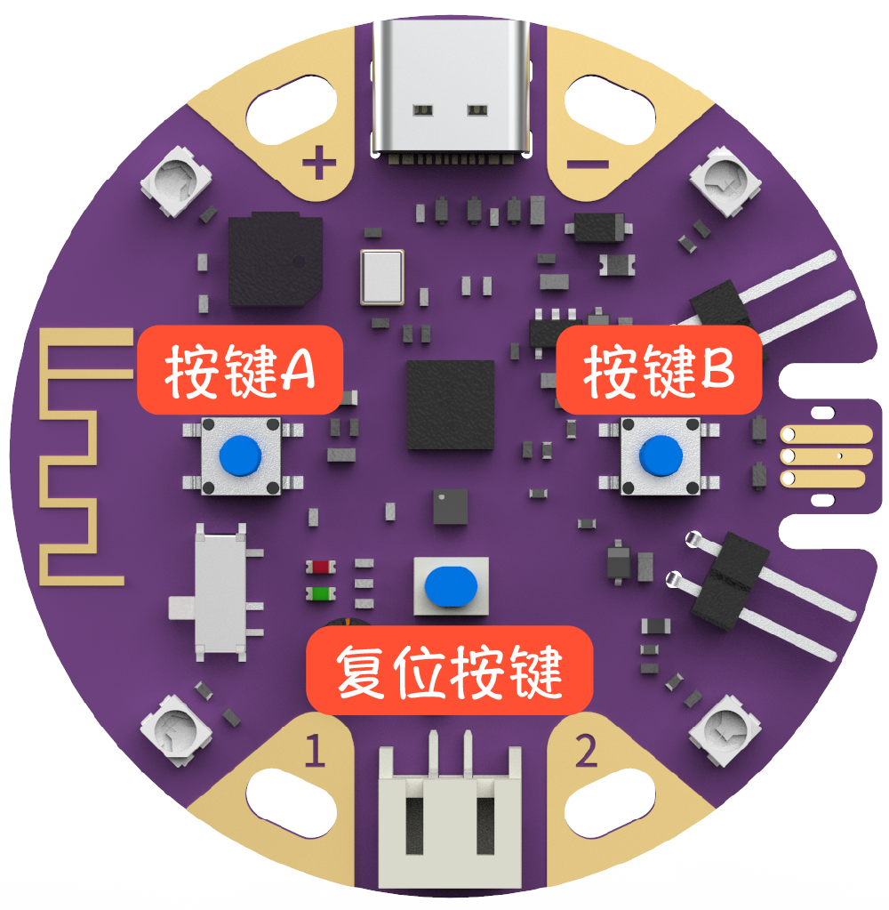
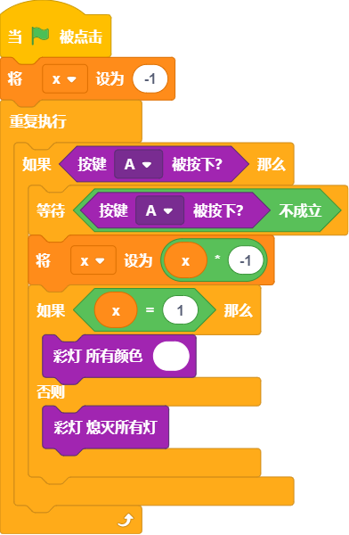

## 概述

---

葡萄板自带2颗可编程按钮A和按键B，另外的复位按键作用是重启葡萄板，多用于让已有的内部程序重新执行

## 应用方式

---

### 积木介绍
| **编程积木块** | **功能介绍** |
| --- | --- |
|  |  - 按键被按下会返回1，反之为0 
（按键按下在电平变化中表现为低电平） |

### 基础案例

#### 案例1 - 按键手电筒

- 效果：通过按键A控制彩灯开启或关闭

- 程序写法

