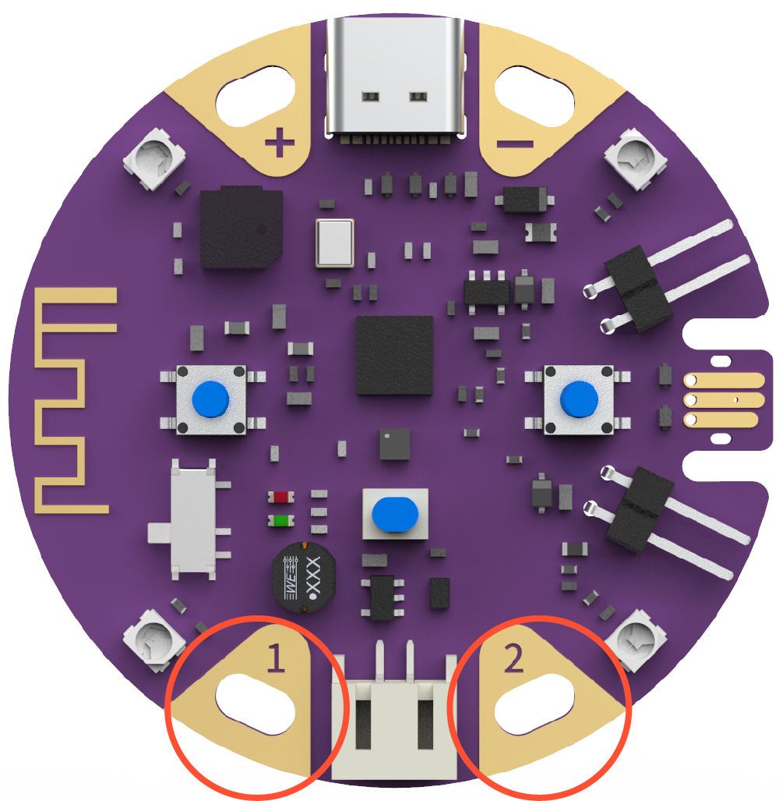
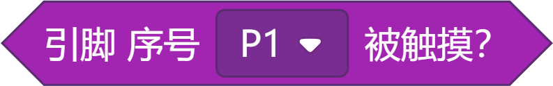
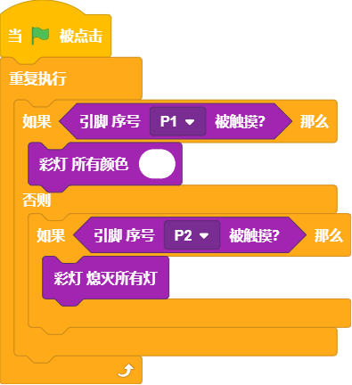
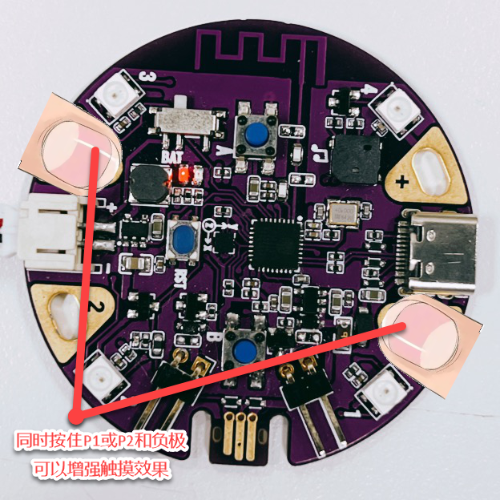

## 概述

---

葡萄板的触摸引脚1和2是2个带有Digital、Analog和PWM功能的IO口，支持借外部模块使用，但连接相对麻烦。 

## 应用方式

---

### 编程积木
| **编程积木块** | **功能介绍** |
| --- | --- |
|  | 引脚被触摸会返回True反之为False 可以通过下拉框切换触摸对象 |

### 程序示例

#### 案例：智能触摸台灯

- 效果：通过触摸控制板载彩灯
- 程序积木

:::warning
**触摸不灵敏的解决办法**

- 原因：受个人体质，以及气候影响，可能会出现触摸不灵敏的情况
- 解决办法：可以 _触摸时同时用另一只手按下葡萄板的负极，让两者接通_

:::

