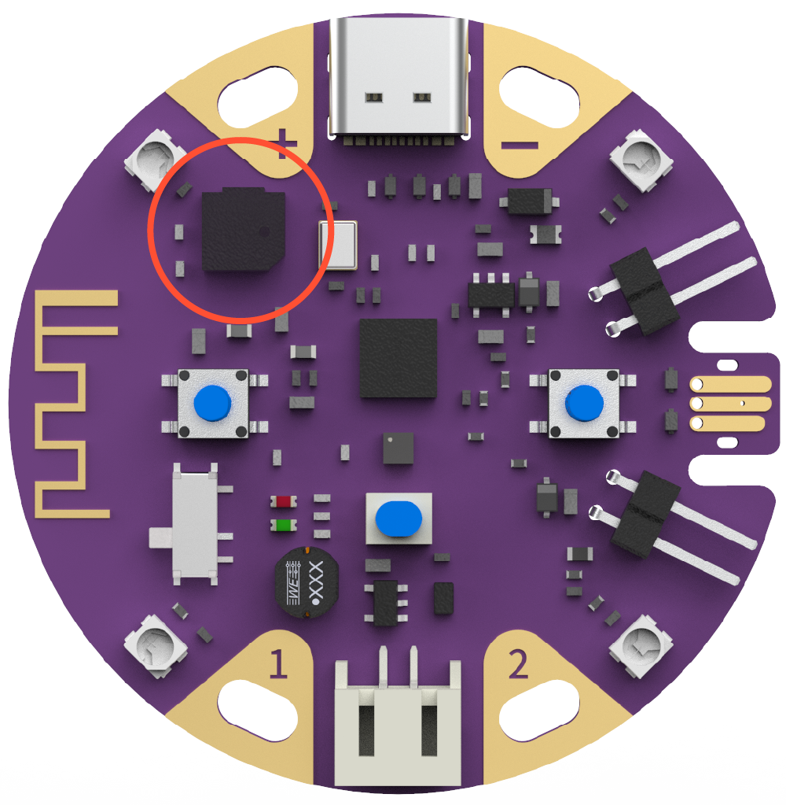
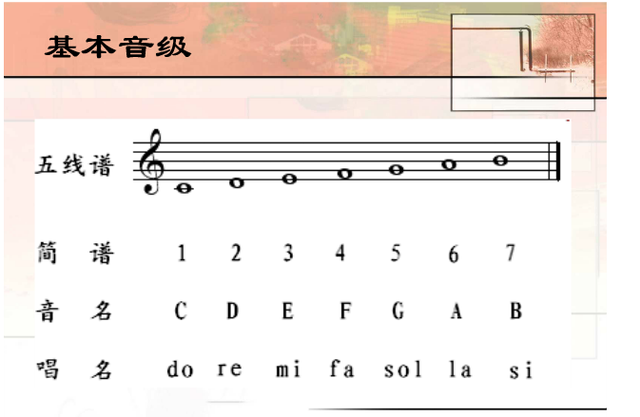
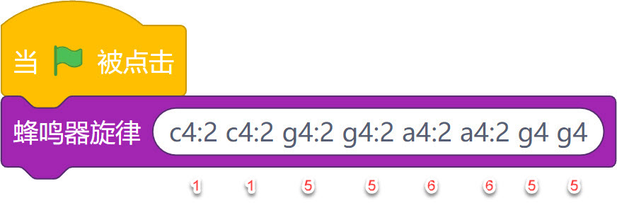
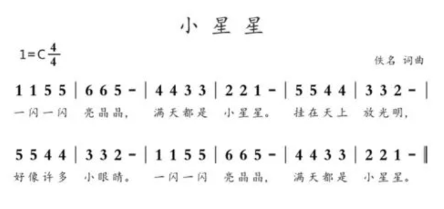
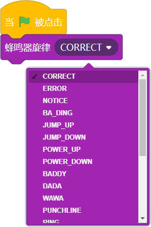

## 概述

---

板载蜂鸣器为无源蜂鸣器，通过不同频率控制发出好听的旋律 

## 应用方式

---

### 积木介绍
| **编程积木块** | **功能介绍** |
| --- | --- |
|  | 指定频率和播放时间 |
|  | 指定频率持续播放 |
|  | 播放指定旋律 |
|  | 播放内置旋律 |
|  | 与持续播放配合使用 |

### 程序示例

#### 案例1 - SOS求助

- 效果：按下按键发出警报，引起周边注意
- 程序积木

#### 案例1 - 播放旋律

- 前置原理介绍，以c4:2为例子
   - c：英式命名法，代表音调，分别对应着do~xi，一个八度大致分为cdefab这7个调子。
   - 4：八度，比如4，为第四八度
   - :2：持续时间，以bpm=120且四分音符为一拍的默认情况下，1秒2拍=>0.5秒/拍，2则代表着4分音符的一半，所以该c4:2的时长持续为0.25s
   - 每个音符之间通过空格分隔

- 编程积木

点击下面的积木可以播放《小星星》的头部曲调，试着自己动手完成接下里的部分吧~ 

- 参考简谱

#### 案例1 - 播放内置旋律
效果：使用这些预设的旋律，更便捷地为你的程序添加动感 
