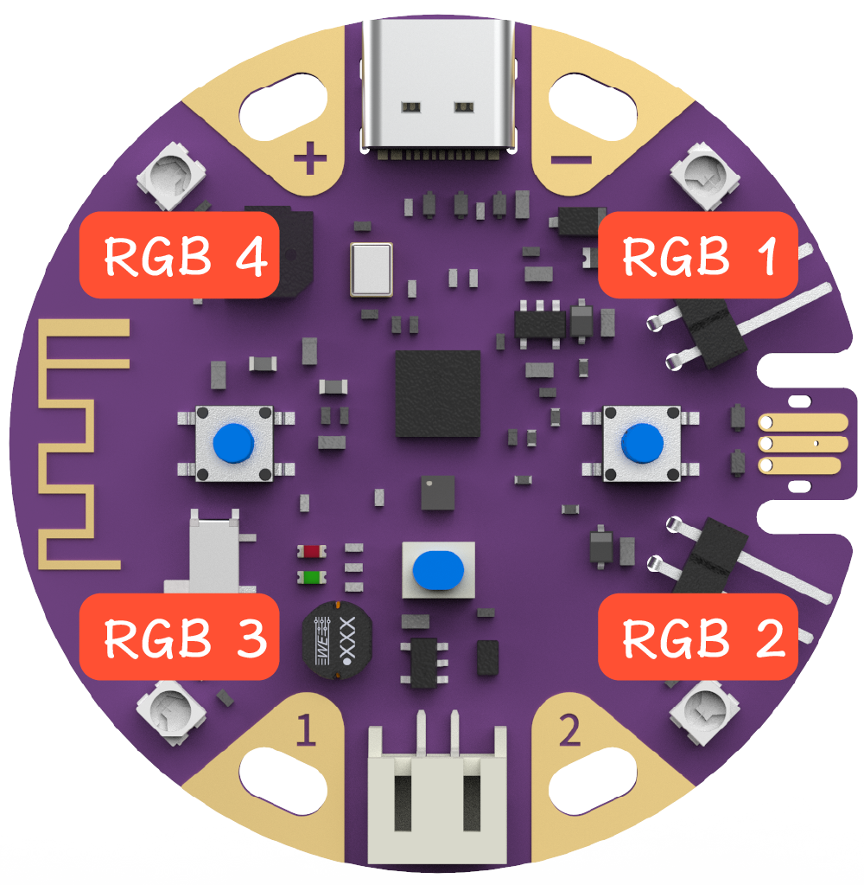
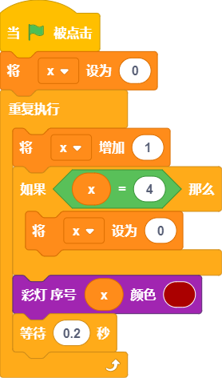
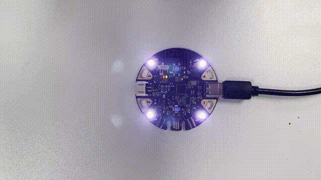
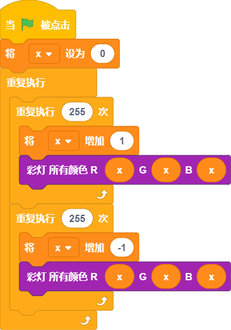

## 概述

---

板载的4颗RGB彩灯是ws2812型号，能够自由地控制其展示不同的颜色、亮度、光效。 

## 应用方式

---

### 积木介绍
| **编程积木块** | **功能介绍** |
| --- | --- |
|  | 一次性设置所有板载彩灯的颜色 |
|  | 设置指定彩灯的颜色 |
|  | 统一所有彩灯的颜色 |
|  | 使用rgb设置彩灯颜色，适用于彩灯特效场景 |
|  | 关闭所有彩灯 |

### 程序示例

#### 案例1 - 流水灯

- 效果

- 程序积木

#### 案例1 - 呼吸灯

- 效果

- 程序积木

