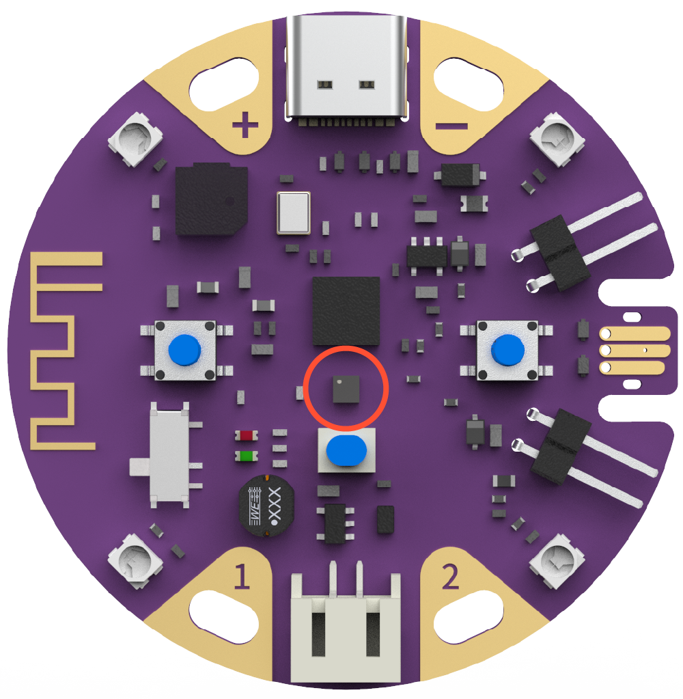
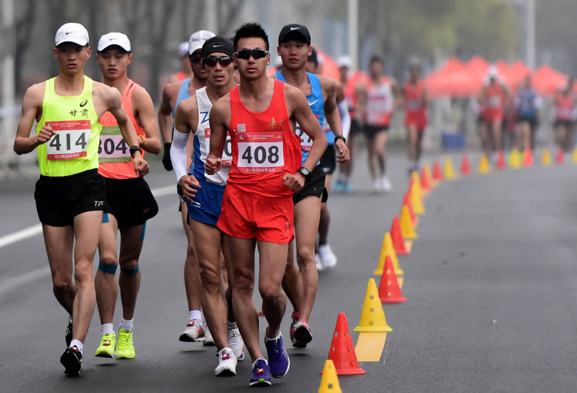
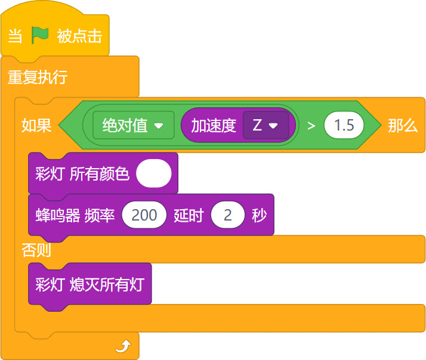
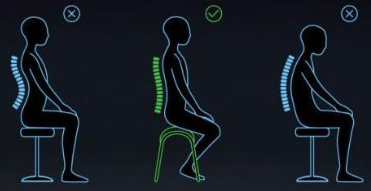
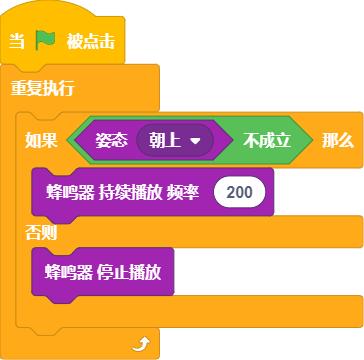

## 概述

---

加速度计传感器能够对3个轴方向的加速度做出数值反馈，当葡萄板相对地球静止不动时，该条件下的矢量加速度为地球重力加速度。

## 应用方式

---

### 积木介绍
| **编程积木块** | **功能介绍** |
| --- | --- |
|  | 可返回X、Y、Z三个轴方向的加速度数值 （单位为g） |
|  | 返回简单的姿态角度 - Pitch：俯仰 - Roll：横滚  |
|  | 姿态检测，若当前葡萄板处于该状态下，该积木执行后返回真 |

### 程序示例

#### 案例1 - 竞走犯规检测

- 效果：当选手动作幅度过大时，葡萄板会发出警报 

 

- 程序积木

#### 案例2 - 坐姿检测

- 效果：将葡萄板放在头顶，如果坐姿不正确，将会发出提示声~ 

- 程序积木

#### 案例3 - 平衡提示

- 效果：维持平衡，让led灯的亮度维持住
- 程序积木 
