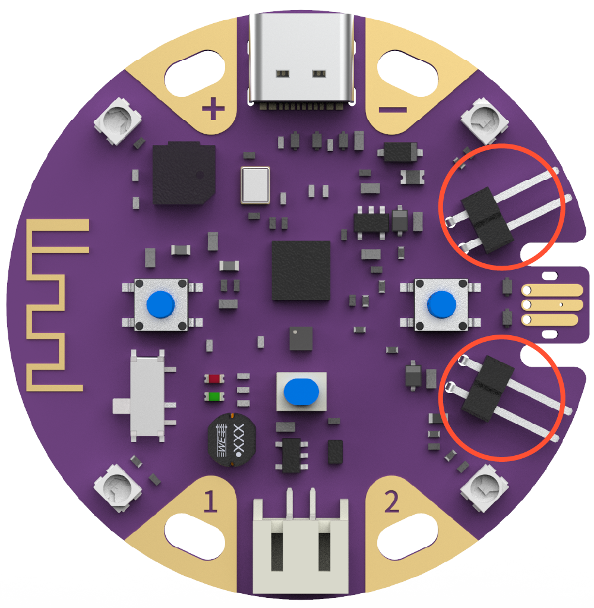
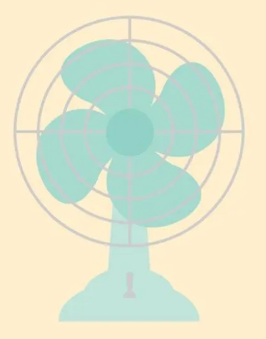
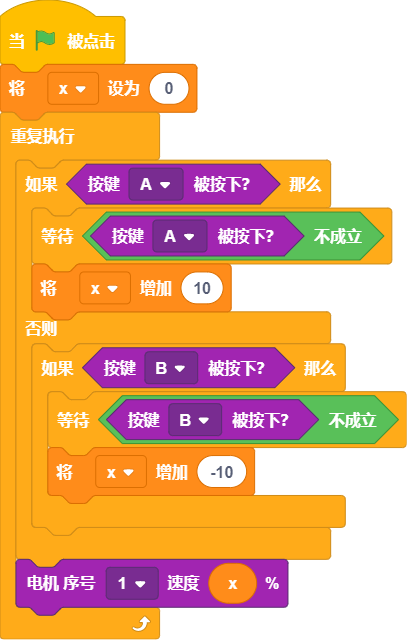

## 概述

---

葡萄板自带电机驱动口，可直接驱动2路3.7～5V的直流电机
:::warning
仅支持单向转动，如制作小车需要转弯可采用单轮定点的转向方式
:::

## 应用方式

---

### 积木介绍
| **编程积木块** | **功能介绍** |
| --- | --- |
|  | 设置电机速度，通过下拉框选择电机对象 |
|  | 同时设置两个电机的速度 |

### 基础案例

#### 案例1 - 迷你风扇

- 效果 

 

- 程序积木**

