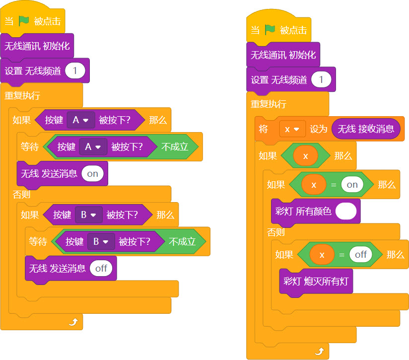
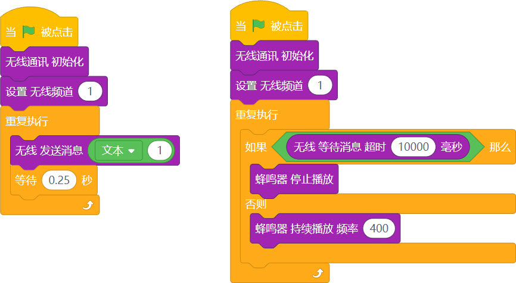

## 概述

---

2.4g无线通讯，采用的是WIFI的特殊频段，仅支持ESP32硬件之间的通讯，无法和标准的WIFi及蓝牙进行通讯
:::warning
该通讯方式支持与葡萄板及未来板进行通讯
:::

## 应用方式

---

### 积木介绍
| **编程积木块** | **功能介绍** |
| --- | --- |
|  | 无线通讯，初始化积木，使用其他无线积木之前，需要先运行此积木 |
|  | 设置无线频道（只有同一频道的板子之间才能通讯） - 参数范围：1~13  |
|  | 获取无线消息，在被使用一次之后，会清空，直到收到下一个无线消息 |
|  | 等待无线消息到来，并返回 |
|  | 发送无线消息 |

### 基础案例

#### 案例1 - 无线开关灯

- 效果：需要两块葡萄板，分别下载控制端和执行端程序，通过控制端端按键A和B控制执行端的彩灯亮与灭
- 程序 - 控制端

- 程序 - 执行端

#### 案例2 - 小孩儿防丢器

- 效果：当两块葡萄板超出距离，无法通讯，家长的葡萄板就会发出警报。

- 程序 - 家长端

- 程序 - 孩子端 

