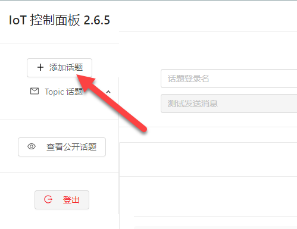
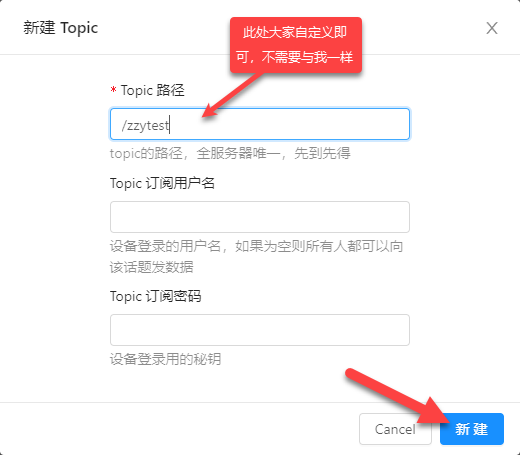
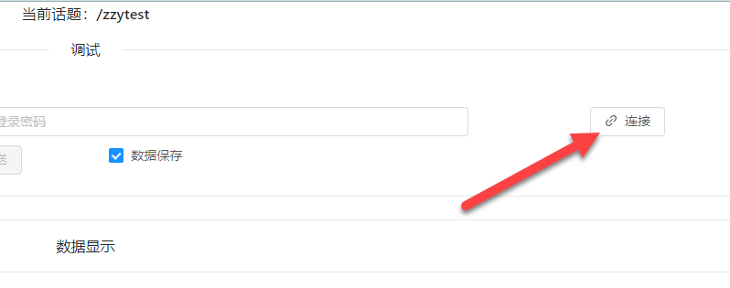
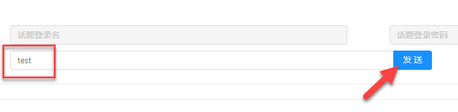
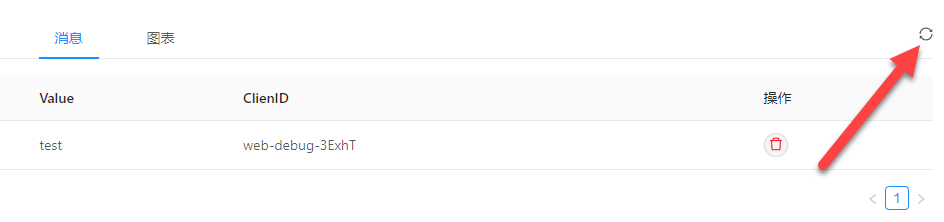
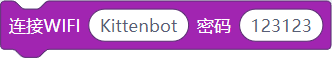
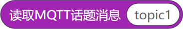
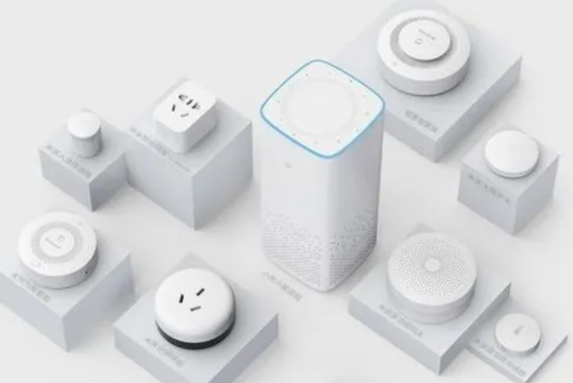
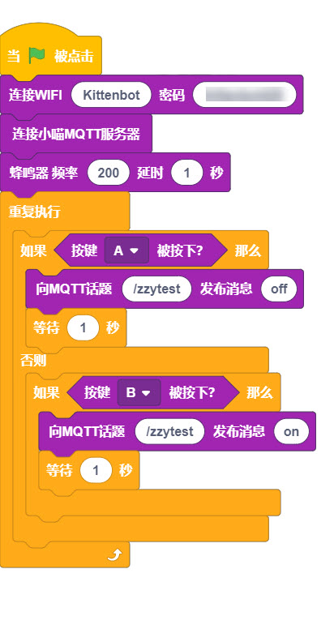
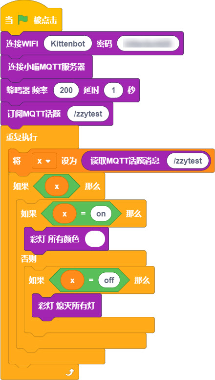

## 概述

---

MQTT是物联网应用中一种订阅制的消息传递协议，其应用方法相对简单。

## 快速开始
:::info
以下的教程案例，将以KittenBot家的IoT平台作为服务器，如果你还没有使用过我们的iot平台请先注册[https://iot.kittenbot.cn/](https://iot.kittenbot.cn/)
:::

1. 创建MQTT话题 

2. 设置话题路径（填写话题用户名和密码可以将话题设置为私人使用，这里暂时不填写，该话题将作为公共话题，所有人获取该话题路径均可查看） 
:::warning
话题全平台唯一，请设置相对个性化的话题，尽量不要设置如temp等常规名称
:::

3. 创建完成，现在点击连接话题 

4. 发送测试消息 
:::warning
可能需要刷新才能看到新的消息 
:::

## 应用方式

---

### 积木介绍
| **编程积木块** | **功能介绍** |
| --- | --- |
|  | 连接wifi |
|  | 返回wifi ip地址，未连接返回0.0.0.0 |
|  | 连接喵家mqtt服务器，公共话题 |
|  | 需要使用私人的mqtt话题，可以使用此积木输入用户名和密码 |
|  | 订阅话题 |
|  | 向话题发送消息 |
|  | 读取话题消息，需要先订阅 |

### 基础案例

#### 案例1 - 智能家居灯
:::warning
这个案例介绍的是两块葡萄板的通讯控制，如果你手头只有一块葡萄板，可以将葡萄板做为`受控端`，并通过MQTT服务器页面直接发送指令给对应话题进行控制
:::

- 效果：以MQTT服务器作为媒介，让你能够远程控制设备

- 程序 - 控制端

- 程序 - 受控端

