通过本章节的阅览，你将从零开始了解如何使用产品，如果你是没有编程经验的入门者，请一步不差跟着操作。

## 软件准备

---

Kittenblock是由深圳市小喵科技从2016年⾃主开发的⼀款PC端口图形化编程软件，打通软硬件编程，⽀持喵家硬件和市⾯上的热⻔硬件Microbit、Arduino等。以丰富的人工智能插件著称，集合多种⼈⼯智能插件和物联⽹插件，⽀持⼀键转python，⽀持⼀键导⼊原⽣项⽬。⻬全⽽丰富的插件，让⽤户⽆需频 繁更换软件，同时打破知识孤岛，降低⽤户的学习成本和⻔槛，让⽤户更专注创意的项⽬制作。Kittenblock⾃2016年推出以来已⾛进了2000多所学校与机构，为中小学提供低门槛低成本的人工智能学习教育方案。

:::info
葡萄板在最新的 **Kittenblock1.89**版本中支持，使用前请下载软件 [点击下载Kittenblock1.89](https://kittenbot.cn/kittenblock_download)
:::

## 连接主控板

---

### 有线连接

1. 硬件连接，使用Type-C型的USB数据线连接葡萄板与电脑
:::warning
遇到问题？

- 尽量使用原装数据线，或确保具有数据通讯功能的数据线（非单纯充电线）
- 如果使用台式机，建议使用电脑机箱后的USB口，保证供电电流充足（尽量不使用分线器）
:::

2. 打开Kittenblock编程软件 => 选择硬件 => 葡萄板 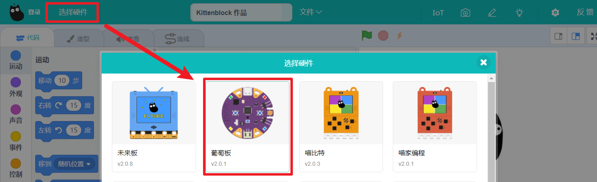

3. 连接串口 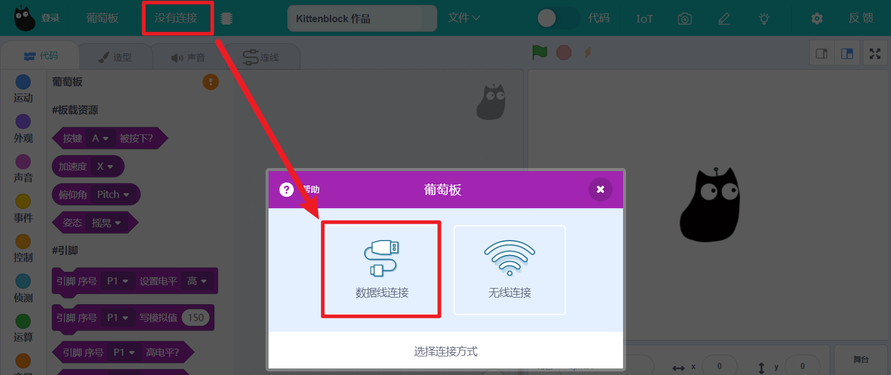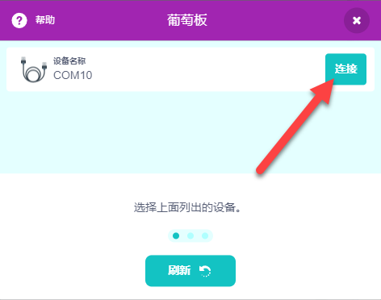

4. 连接完成 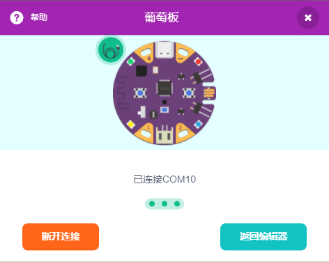

### 无线连接
无线连接是基于葡萄板蓝牙。请按照如下流程完成蓝牙连接

1. 使用电池或者USB数据线供电 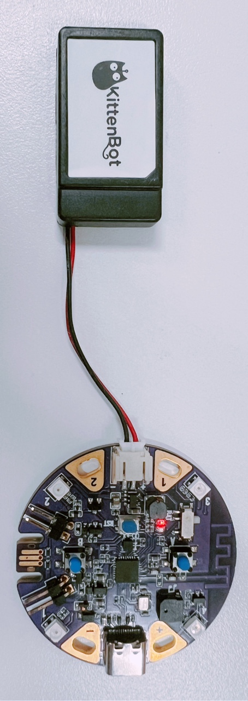
:::warning
使用电池供电条件下，需要打开半载电池电源开关，如图拨动到BAT标记一侧 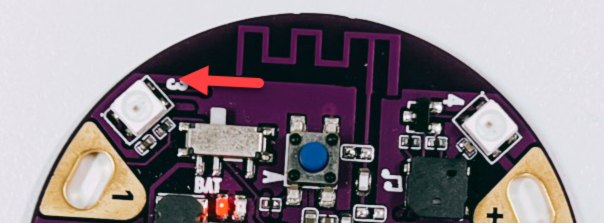
:::

2. 按下葡萄板复位按键，让葡萄板重启。注意在启动中 大约有3s时间为白色RGB轮转，在该时间内按下任意A或B按键，RGB灯变为蓝色表明成功进入蓝牙模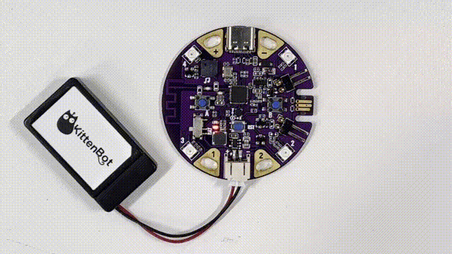

3. 软件端选择好葡萄板后，在连接中选择 `无线连接` 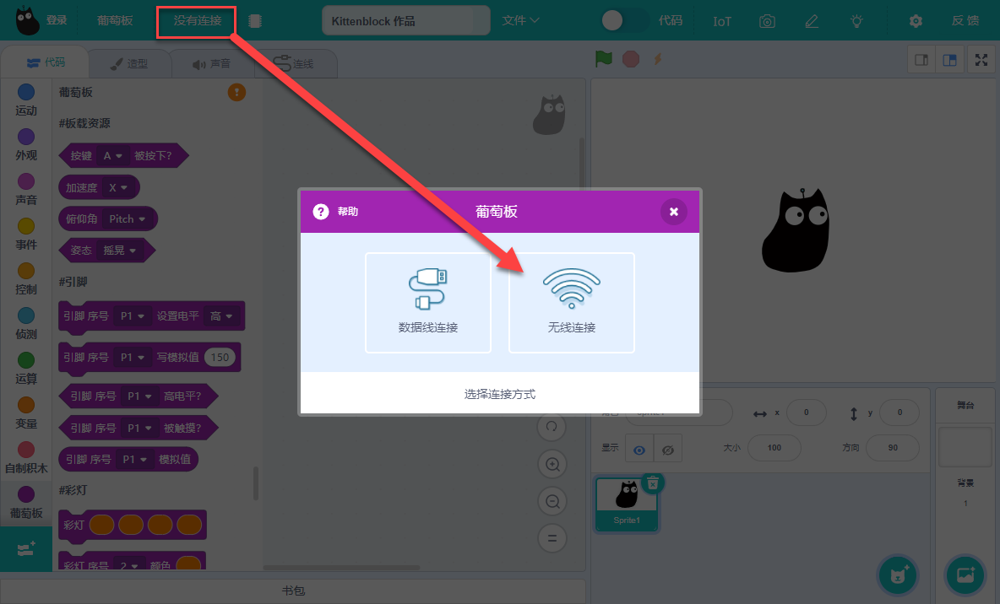

4. 等待查找设备，搜索到grapebit打头的即是目标硬件 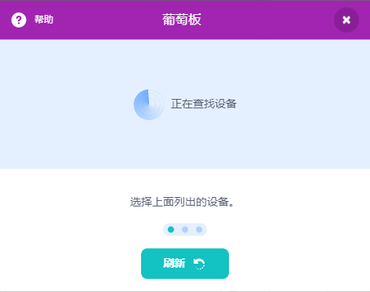

5. 连接完成，可以顺利进行下一步了 

## 两种控制模式

---

Kittenblock中有两种硬件控制模式，`舞台交互`和`代码上传`

### 舞台交互

#### 案例1 - 控制硬件发声
从左侧分栏中拖出 **蜂鸣器积木块**，点击积木块。可以听到葡萄板有声音响起。 

#### 案例2 - 陀螺仪控制舞台角色

1. 从左侧葡萄板分栏中脱出 **姿态角积木块**，通过下拉框选择**左倾**和**右倾**的姿态 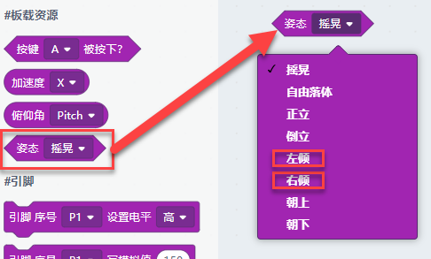

2. 将程序按照图示拼接，通过葡萄板姿态反馈，改变精灵角度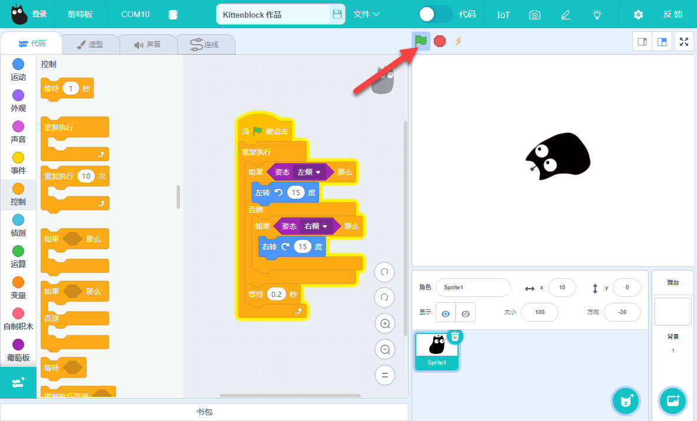

3. 效果演示 

### 上传程序
当需要主控板脱离电脑运行指定程序时，就需要将程序上传到硬件里。葡萄板开机默认会检查文件系统中的main.py文件，并执行文件内程序。
:::warning
需要上传的程序中不能包含硬件以外舞台和角色相关的积木块
:::

搭建如图程序，切换出代码窗口（上传模式），点击上传 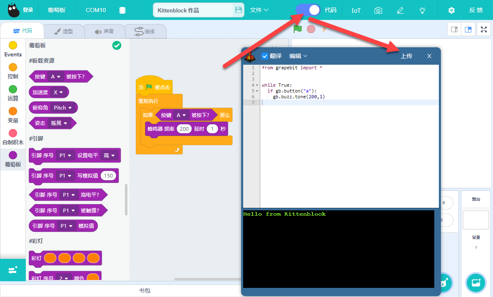
