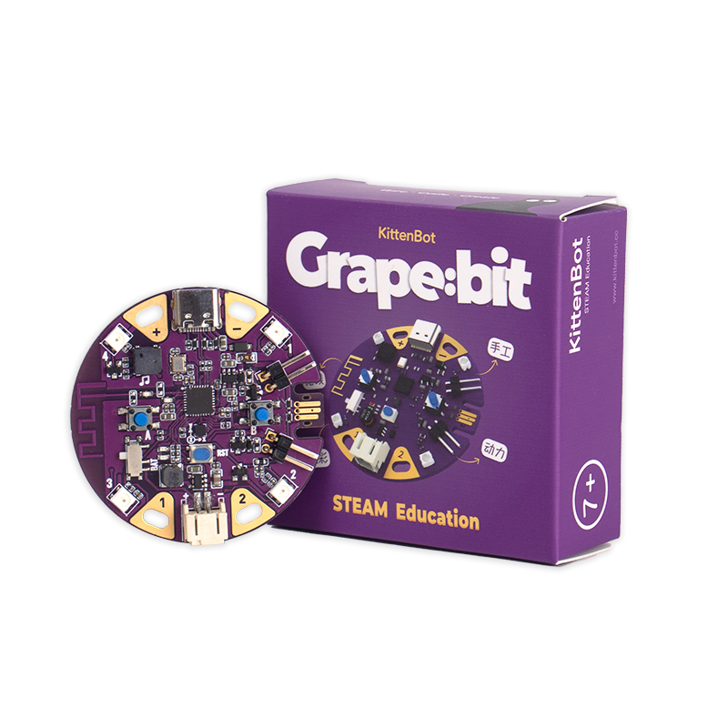

# 店铺购买

---

🛒[** Kittenbot-Grape:bit**](https://item.taobao.com/item.htm?spm=a2oq0.12575281.0.0.37eb1debi6QRbc&ft=t&id=689037285648)

# 产品详情

---

葡萄板是主打二到三年级信息科技课学习及机构教学的编程主控板，其核心是国产ESP32，具有性能高、无线通讯、图形化编程等特色。有效提升信息技术思维、拓展手工技能、增强创新创作能力。葡萄板的使用简单、课程具备，且价格普惠，相较于其他同类型主控板更适合于孩子入门编程。

##   特色

- 编程应用层面：
   - 支持蓝牙连接编程，更适用于基于平板的教学场景
- 课程知识层面：
   - 知识点分布均匀，根据循序渐进的螺旋上升式模型设计课程形态，解决孩子上手难、兴趣低的窘境
- 功能属性层面：
   - 包含声音、彩光、体感、触摸、运动、无线等实用性功能，跨学科属性强，创作无边界
- 附属价值层面：
   - 支持板对板局域网通讯，适用于创作艺术互动作品、拓展物联网应用
   - 预留全新单总线协议传感器接口，后续支持拓展更多创意

##   适用场合

- 机构2～3年级的低龄学员编程入门课
- 信息科技课教学
- 编程社团课

##   参数详情
| **尺寸** | 49 x 49 x 9.8 mm |
| --- | --- |
| **净重** | 9.4g |
| **主控芯片** | EPS32-C3 (RISC-V 32 位单核处理器、2.4~2.5 GHz WIFI & Bluetooth 5 (LE) 蓝牙、400 KB SRAM、4MFlash、160MHz主频) |
| **供电电压** | 5V（Type-C USB）、3.7~4.2V（锂电包可充电） |
| **板载资源** | 2颗可编程按键、触摸金手指—可编程IO(2个)、三轴加速度计、2.4gWiFi无线、蓝牙、无源蜂鸣器、4 颗全彩ws2812灯珠、两路电机控制、JacDac接口（预留口暂时未开放） |
| **编程平台** | Kittenblock |

 

##   硬件细节
  
